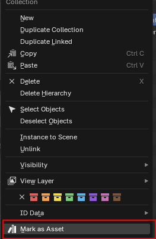

# Blueprints

## What are blueprints 

- blueprints are just Blender collections , and reuseable "prefabs":
  - as long as they have been defined in one of the library scenes
  - have at least one instance
  - or have been marked as assets

## How to create a blueprint

Since blueprints are just Blender collections with a tiny bit of extra configuration, you can use your normal Blender workflow.

But here is Blueprint creation in more detail:

- create a library scene if you do not have one
- make sure to tag the scene as a library scene in the Blenvy settings
- create a collection

- add anything you want inside your blueprint

- add any component you want to your blueprint (see [here](./README-components.md#adding-components) for more details)

## How to use blueprints

- Once you have create a blueprint as outlined above, go to one of your [level](./README-levels.md) scenes and add a collection instance
- or 
    - if you do not want to create an instance as part of a level (for blueprint instances that need to be spawned dynamically while your game is running)
    - if your project is a pure library project (no levels, just blueprints for reuse) , right click on the collection & click on "mark as asset"

## Viewing all of your project's blueprints

If you want to view all of your blueprints, navigate to the Blueprints tab

- you will be able to see both the local blueprints (defined in the current .blend file) and the ones from external asset files (defined in other .blend files)
- you can click on the selection tool (arrow icon) to automatically go to the scene where the blueprint is defined & automatically select it

## Exporting blueprints

- blueprint export is automatic if you have toggle the ["auto export"](./README.md#auto-export-default-true) setting in the configuration 
- you can also force per blueprint systematic export (regardless of change detection), by checking the "always export" checkbox in the Blueprints tab

* those blueprints will be exported on every save
* this option is disabled for external blueprints
    
