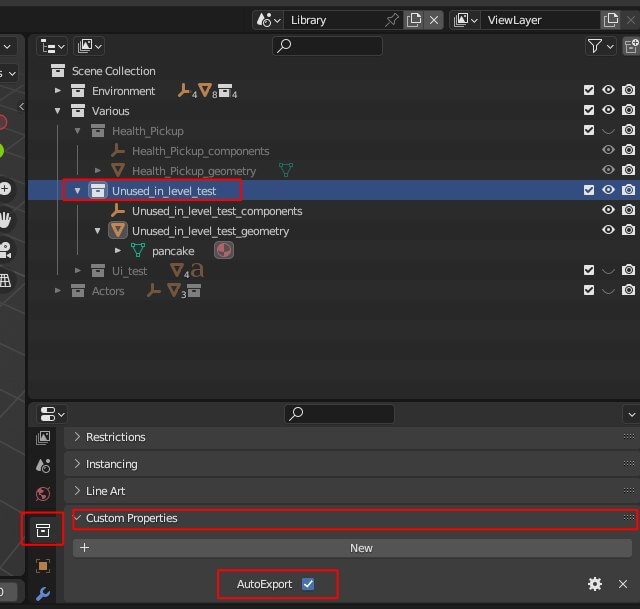

### Blueprints

You can enable this option to automatically replace all the **collection instances** inside your level scene with blueprints
- whenever you change your level scene (or your library scene , if that option is enabled), all your collection instances 
    * will be replaced with empties (this will not be visible to you)
    * those empties will have additional custom properties / components : ```BlueprintInfo``` & ```SpawnBlueprint```
    * your level scene/ level will be exported to a much more trimmed down gltf file (see next point)
    * all the original collections (that you used to create the instances) will be exported as **seperate gltf files** into the "library" folder

- this means you will have 
    * one small main gltf file (your level/world)
    * as many gltf files as you have used collections in the level scene , in the library path you specified :
    for the included [basic](../../examples/bevy_gltf_blueprints/basic/) example's [assets](../../examples/bevy_gltf_blueprints/basic/assets/), it looks something like this: 

    
    
    the .blend file that they are generated from can be found [here](../../examples/bevy_gltf_blueprints/basic/assets/advanced.blend)

- the above only applies to collections that have **instances** in your level scene!
    if you want a specific collection in your library to always get exported regardless of its use, you need to add 
    a **COLLECTION** (boolean) custom property called ```AutoExport``` set to true
    > not at the object level ! the collection level !

    

    It will get automatically exported like any of the "in-use" collections.

- you can also get an overview of all the exported collections in the export menu

    
