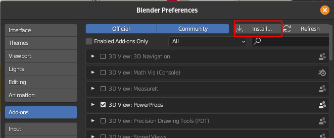
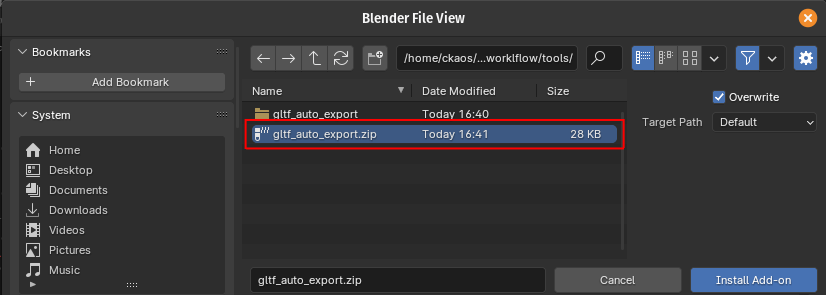
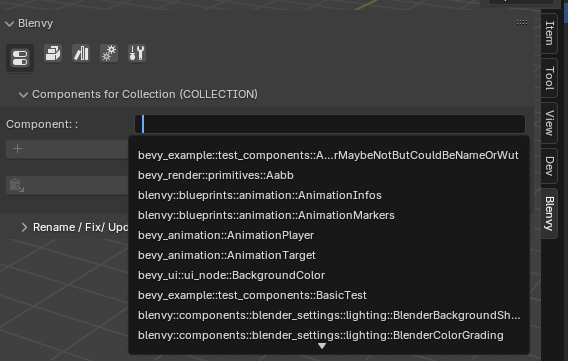

# Blenvy: Blender add-on


This [Blender addon](https://github.com/kaosat-dev/Blender_bevy_components_workflow/tree/main/tools/blenvy) gives you:
- an easy to use UI to add and configure your [Bevy](https://bevyengine.org/) components inside Blender 
    - the UI is **automatically generated** based on a **registry schema** file, an export of all your **registered** Bevy components's information, generated
by the registry export part of the [Blenvy](https://crates.io/crates/blenvy) crate
    - the ability to **toggle components** on/off without having to remove the component from the object

- an automatic export of your level/world from Blender to gltf whenever you save your Blend file.
    - export of used /marked collections as [Gltf blueprints](../../crates/blenvy/README.md)
    - change detection, so that only the levels & blueprints you have changed get exported when you save your blend file
    - export of material librairies

- a way to setup you assets for your levels & blueprints in Blender

If you want to know more about the technical details , see [here]()

> IMPORTANT !! if you have previously used the "old" add-ons (*gltf_auto_export* & *bevy_components*), please see the [migration guide](../../Migration_guide.md)
If you can I would generally recommend starting fresh, but a lot of effort has been put to make transitioning easier


## Installation: 


* grab the latest release zip file


* in Blender go to edit =>  preferences => install



* choose the path where ```blenvy.zip``` is stored




## Quickstart


## Configuration:


### Bevy side

 - setup the [Blenvy crate](https://crates.io/crates/blenvy) for your project (see the crate's documentation for that), and compile/run it to get the ```registry.json``` file to enable adding/editing your components in Blender

### Blender side

> The add-on comes almost mostly pre-configured with sensible defaults, but you can set the following settings to your liking

#### Common

you **need** to tell Blenvy 
    - what your level scenes are (what Blender scenes should become levels in Bevy) 
    - what your library scenes are (what Blender scenes will store your library of re-useable blueprints) 

Blenvy is opinionated ! 
    - keep you art/sources (usually not delivered with your game) seperate from your game assets
    - keep your blueprints/levels/materials gltf files seperate

#### Components

> the defaults are already pre-set to match those on the Bevy side for the location of the ```registry.json``` file, unless you want to store it somewhere other than ```assets/registry.json```

- Go to the new Components tab in the **configuration** tab


- click on the button to select your registry.json file (in the "configuration" panel)


- the list of available components will appear


##### registry file polling

* by default, the add-on will check for changes in your registry file every second, and refresh the UI accordingly
* you can set the polling frequency or turn it off if you do not want auto-refresh


#### Auto-export

### Materials

You can enable this option to automatically generate a **material library** files that combines all the materials in use in your blueprints.


Since each blueprint is normally a completely independant gltf file, without this option, if you have a material with a large texture for example, 
**ALL** of your blueprints using that material will embed that large texture, leading to **significant bloat & memory use**.

- When this option is enabled, you get a single material library per Blender project, and a **MaterialInfo** component is inserted into each object using a material.
- The correct material will then be inserted on the Bevy side (that loads any number of material libraries that you need) into the correct mesh (see the configuration
options in **bevy_gltf_blueprints** for more information on that)
- Only one material per object is supported at this stage, ie the last material slot's material is the one that is going to be used


TLDR: Use this option to make sure that each blueprint file does not contain a copy of the same materials 


### Multiple blend file workflow

If you want to use multiple blend files, use Blender's asset library etc, we got you coverred too !
There are only a few things to keep in mind 

#### Assets/library/blueprints files
- mark your library scenes as specified above, but **do NOT** specify a **level** scene
- mark any collection in your scenes as "assets"
- choose "split" for the combine mode (as you want your gltf blueprints to be saved for external use)
- do your Blender things as normal
- anytime you save your file, it will automatically export any relevant collections/blueprints
- (optional) activate the **material library** option, so you only have one set of material per asset library (recomended)

#### Level/world files
- mark your level scenes as specified above ( personally I recommended **NOT** specifying a **library** scene in this case to keep things tidy, but that is up to you)
- configure your asset libraries as you would usually do, I recomend using the "link" mode so that any changes to asset files are reflected correctly
- drag & drop any assets from the blueprints library (as you would normally do in Blender as well)
- choose "split" for the combine mode (as you want your gltf blueprints to be external usually & use the gltf files generated from your assets library)
- do your Blender things as normal
- anytime you save your file, it will automatically export your level(s)

Take a look at the [relevant](../../examples/demo/) example for more [details](../../examples/demo/art/) 


## Useage

### Components

#### adding components

- to add a component, select an object, collection, mesh or material and then select the component from the components list: (the full type information will be displayed as tooltip)



- click on the dropdown to get the full list of available components


- you can also filter components by name for convenience


- add a component by clicking on the "add component" button once you have selected your desired component
  
  it will appear in the component list for that object


#### editing components

- to edit a component's value just use the UI: 


#### copy & pasting 

- you can also copy & paste components between objects

- click on the "copy component button" of the component you want to copy


- then select the object you want to copy the component (& its value) to, and click on the paste button.

It will add the component to the select object


> if the target object already has the same component, its values will be overwritten


#### Additional components UI features


##### Toggling component details

- for large/ complex components you can toggle the details of that component:


##### Supported components

- normally (minus any bugs, please report those!) all components using **registered** types should be useable and editable
- this includes (non exhaustive list):
  * enums (even complex ones !)

    

    

  
  * complex structs, with various types of fields (including nested ones)

    

  * lists/ vecs (here a vec of tuples)

    

  * etc !

##### Unregistered types & error handling

- non registered types can be viewed in this panel : (can be practical to see if you have any missing registrations too!)

    

- if you have a component made up of unregistered structs/enums etc, you will get visual feedback & the component will be deactivated

    

  > see [here](#invalidunregistered-type-renaming--conversion) for ways to convert invalid / unregistered components to other types.


- if you are encountering this type of view: don't panic your component data is not gone ! It just means you need to reload the registry data by clicking on the relevant button

    

## Levels

## Blueprints


## Technical details

- adds **metadata** to objects containing information about what components it uses + some extra information
- uses Blender's **PropertyGroups** to generate custom UIs & connects those groups with the custom properties so that no matter the complexity
of your Bevy components you get a nicely packed custom_property to use with ...
- supports any number of main/level scenes 
    - Blender scenes where you define your levels, and all collection instances are replaced with "pointers" to other gltf files (all automatic)
- supports any number of library scenes
    - Blender scenes where you define the assets that you use in your levels, in the form of collections
- automatic export of **changed** objects & collections only ! a sort of "incremental export", where only the changed collections (if in use)
        get exported when you save your blend file

### Components

changing the values of a component in the UI  will automatically update the value of the underlying entry in the ```bevy_components``` custom property


### Internal process (simplified)

This is the internal logic of the export process with blueprints (simplified)


ie this is an example scene...


and what actually gets exported for the level scene/world/level


all collections instances replaced with empties, and all those collections exported to gltf files as seen above


## Known issues & limitations:

* **Range** data (ie ```Range<f32>``` etc) are not handled at this time (issue seems to be on the Bevy side)
* **Entity** structs are always set to 0 (setting entity values on the Blender side at this time does not make much sense anyway) 


## Development 

- I highly recomend (if you are using vscode like me) to use 
[this](https://marketplace.visualstudio.com/items?itemName=JacquesLucke.blender-development) excellent extension , works easilly and fast , even for the latest 
versions of Blender (v4.0 as of this writing)
- this [article](https://polynook.com/learn/set-up-blender-addon-development-environment-in-windows) might also help out 
(easy enough to get it working on linux too)

## License

This tool, all its code, contents & assets is Dual-licensed under either of

- Apache License, Version 2.0, ([LICENSE-APACHE](../LICENSE_APACHE.md) or https://www.apache.org/licenses/LICENSE-2.0)
- MIT license ([LICENSE-MIT](../LICENSE_MIT.md) or https://opensource.org/licenses/MIT)